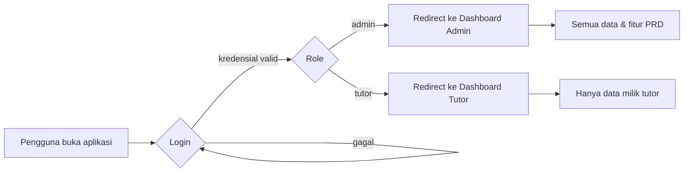
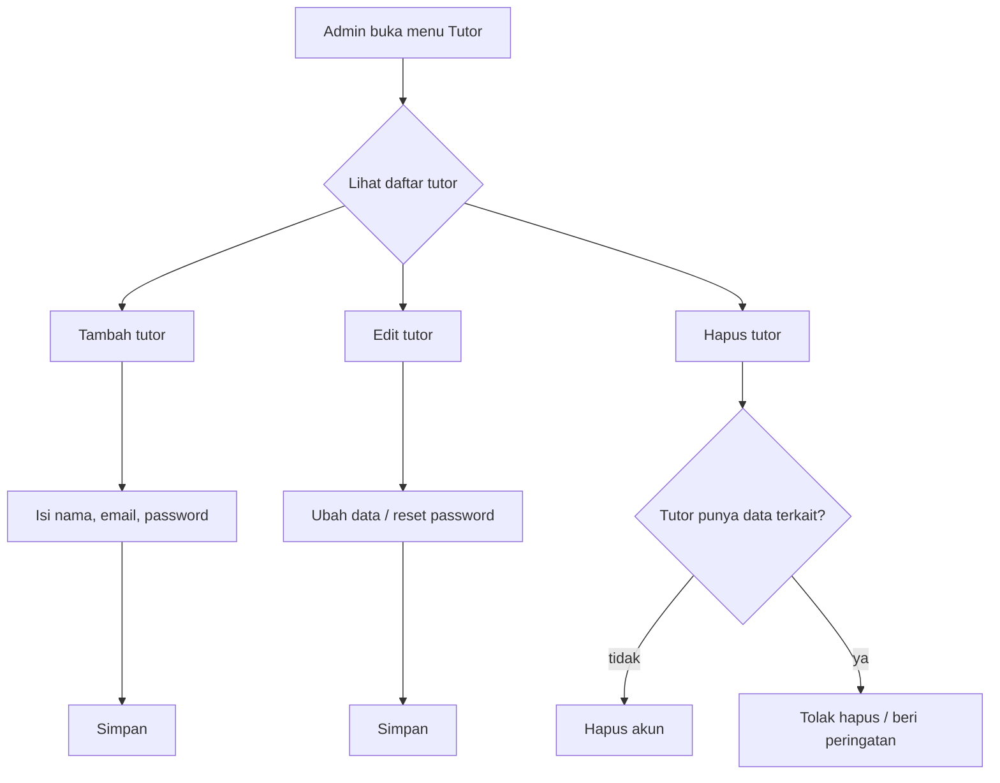
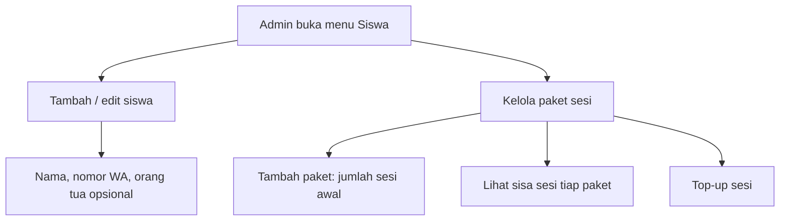
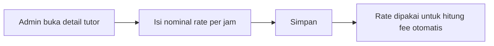
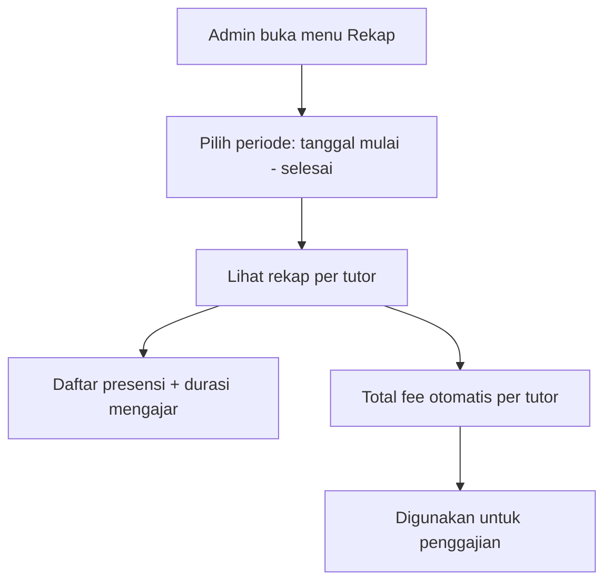
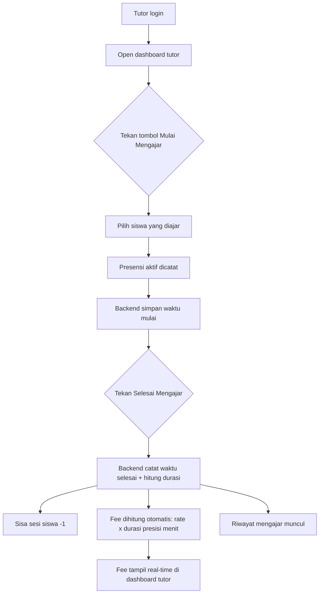
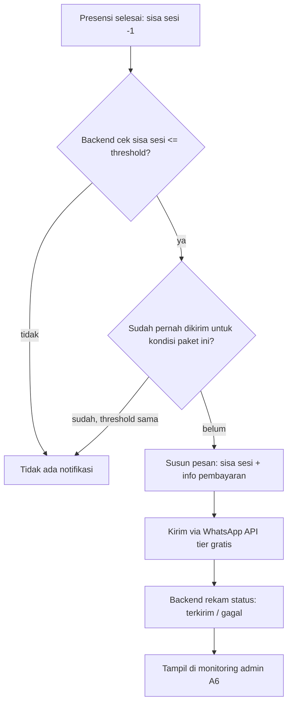
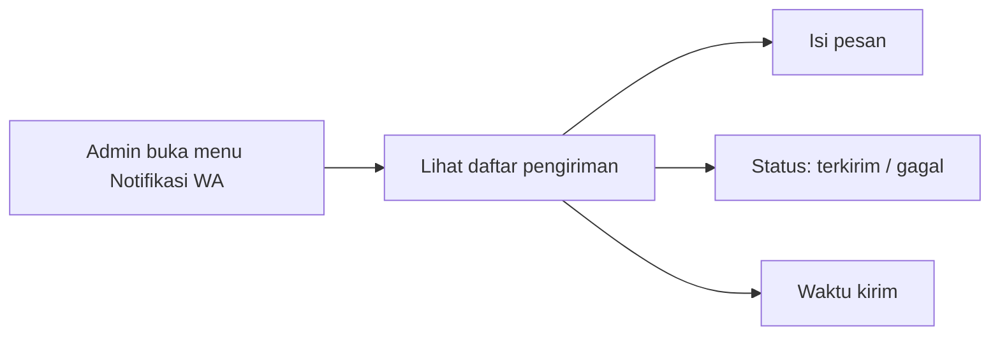

# User Flow — Sistem Manajemen Bimbel (sinabimbel)

> Berdasarkan `docs/PRD.md`. Flow berikut adalah alur utama yang harus didukung sistem. Nomor fitur (A1, T3, W1, dst.) merujuk ke PRD.

---

## 1. Login & Role

**Aturan:**
- Belum login → akses halaman dashboard ditolak, diarahkan ke login.
- Role menentukan halaman yang bisa dibuka (T1, T2).

---

## 2. Kelola Akun Tutor (Admin — A1)

**Aturan:** password bisa diatur saat tambah dan direset saat edit.

---

## 3. Kelola Siswa & Paket Sesi (Admin — A2)

**Aturan:** sisa sesi tidak diubah manual dari sini — hanya berkurang otomatis via presensi (5.3). Admin bisa menambah paket baru / top-up.

---

## 4. Atur Rate Fee Tutor (Admin — A3)

---

## 5. Rekap Presensi & Fee per Periode (Admin — A4, A5)

**Aturan:** periode dinamis (asumsi #6 PRD). Total fee = hasil kalkulasi backend dari presensi × rate.

---

## 6. Presensi Mengajar (Tutor — T3, T4, T5)

**Aturan:**
- Satu tutor hanya boleh punya 1 presensi berjalan (presensi ganda ditolak).
- Waktu mulai/selesai dicatat di backend, bukan klaim dari frontend (anti-manipulasi).
- Presensi selesai tidak bisa diedit tutor (koreksi hanya admin).
- Sisa sesi −1 diproses backend setelah presensi selesai (5.3).

---

## 7. Penagihan Otomatis via WhatsApp (W1–W5)

**Aturan (W4):** anti-duplikat — tidak kirim ulang untuk threshold yang sama pada paket yang sama; kirim lagi hanya saat threshold berikutnya tercapai (mis. ≤ 3, lalu ≤ 1).

---

## 8. Monitoring Notifikasi (Admin — A6)

